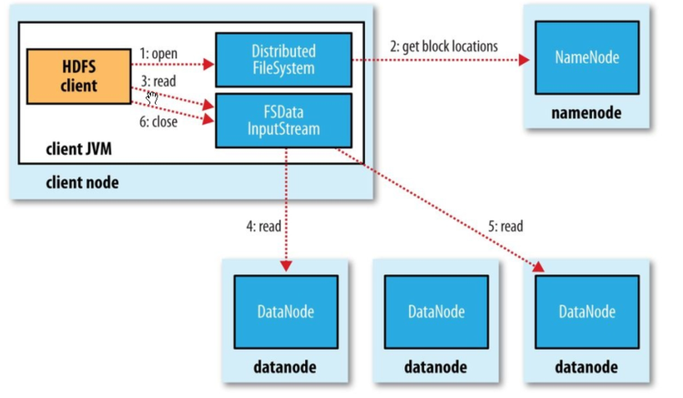
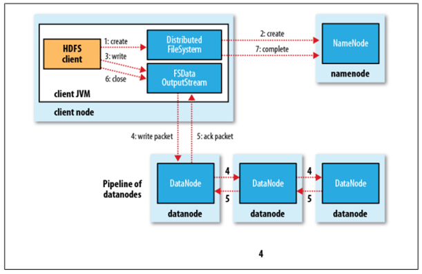

# HDFS的读写流程

## HDFS读数据的流程

1. client创建DistributeFileSystem对象，向集群中的NameNode发起远程rpc调用，获取文件block块的位置
2. NameNode返回每个block块所在的DataNode的集合
3. client对最近的DataNode建立连接并读取数据
4. DataNode返回Block块数据
5. Client获取到全部Block块数据后，合并成一个完整的文件，随后关闭连接。

## HDFS写数据流程

1. client创建DistributeFileSystem对象，向NameNode发送写请求，创建输出流

2. NameNode检验是否有权限以及文件是否存在

3. 客户端将文件切分成128M每块

4. client再次请求NameNode，询问第一个block存放的位置

5. 得到存放block的DataNode的集合后，client与第一个NameNode建立pipeline连接，第一个节点与第二个节点建立连接，以此类推连接所有节点

6. 连接建立后，client开始向第一个节点发送数据，数据以64KB的package发送，第一个节点接收数据后转发到第二个节点，直至每个节点，节点接收数据后会返回一个ack应答队列

7. 当第一个block发送完成后，client再次请求NameNode，询问下一个block存放的位置

8. 当所有block发送完成，client向NameNode发送消息，告知写入完成

   