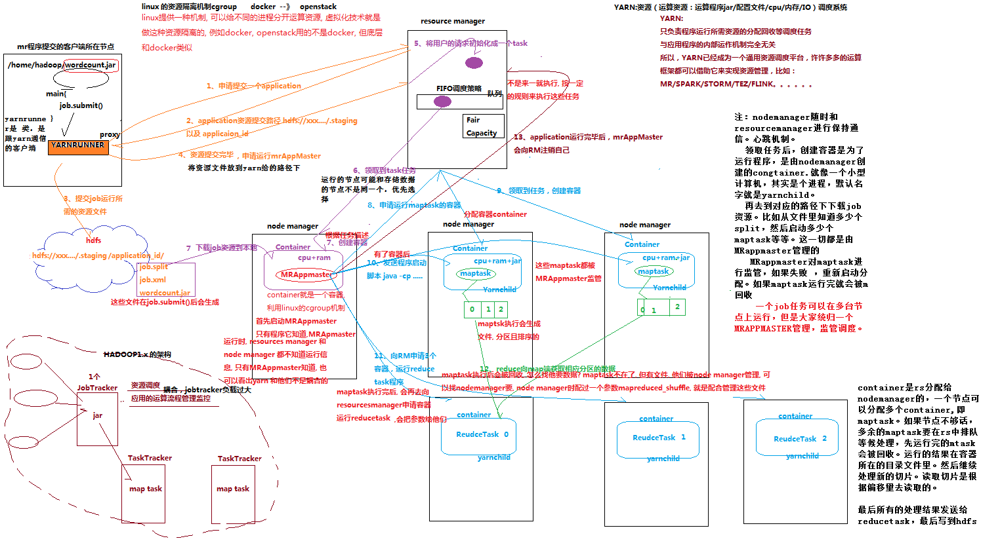

# YARN的作业提交流程

1. MapReduce程序提交到YarnRunner所在节点
2. YarnRunner向ResourceManager申请一个appliation
3. ResourceManager为application分配资源，将资源路径返回给YarnRunner
4. YarnRunner将资源提交到HDFS
5. 程序提交完成后，YarnRunner向ResourceManager申请运行MRAppMaster
6. ResourceManager将用户的请求初始化成一个Task
7. NodeManager领取到Task任务
8. NodeManager创建容器Container，并产生MRAppMaster
9. Container从HDFS上下载所需资源（CPU+RAM）
10. MRAppMaster向ResourceManager申请MapTask容器
11. ResourceManager将MapTask任务分配给另外两个NodeManager
12. MRAppMaster向另外两个接受任务NodeManager发送程序启动脚本
13. MRAppMaster向ResourceManager申请两个Container容器用来运行ReduceTask
14. ReduceTask向MapTask获取相应分区的数据
15. 程序运行结束后，MRAppMaster向ResourceManager注销自己