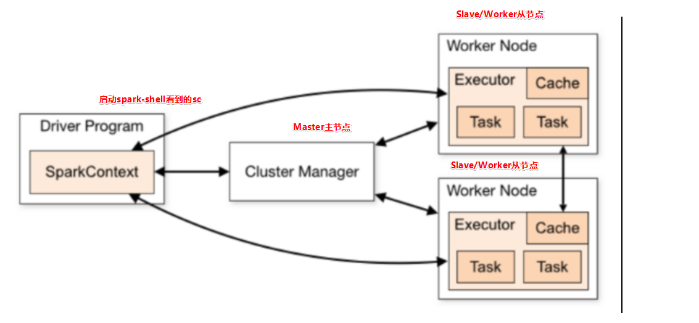

# Spark的组成架构

- Driver：执行main函数，运行SparkContext
- ClusterManager：负责管理集群资源
  - Standalone模式中为Master，即主节点
  - on YARN模式中为资源调度器
- WorkerNode：从节点，负责控制计算节点，启动Executor或Driver
- Executor：执行器，是应用运行在WorkNode上的一个进程

