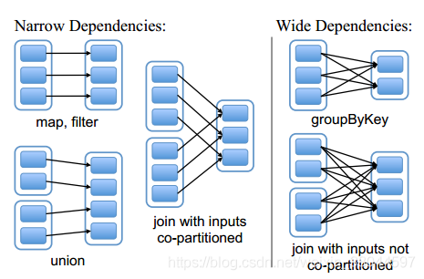
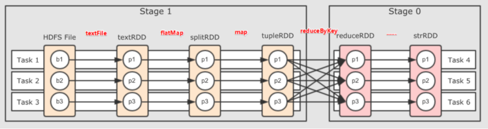

# Spark中RDD的血统与依赖

Spark中，不同RDD之间存在**Lineage**（血统）的概念，血统记录了一个RDD如何从其他RDD转化而来的。血统的存在提高了数据的容错性。

## 宽窄依赖

RDD在Lineage依赖方面分为Narrow Dependencies（窄依赖）与Wide Dependencies（宽依赖）两种依赖关系。

- 窄依赖：

  - 父RDD的分区与子RDD的分区之间存在一对一（或多对一）的关系
  - 即**一个父RDD的分区只能被一个子RDD的分区所依赖**
  - 注意：但一个子RDD的分区可以依赖多个父RDD的分区

- 宽依赖：

  - 父RDD的分区与子RDD的分区之间存在多对多的关系
  - 即**一个父RDD的分区可以被多个子RDD的分区所依赖**
  - 宽依赖又称shuffle dependency，即产生shuffle的算子会产生宽依赖
  - 宽依赖会截断血统

  

  

  

## Spark中stage的划分

将DAG从后往前依次判断，遇到宽依赖就划分一个Stage，遇到窄依赖就加入到当前Stage中。

shuffle -> 宽依赖 ->  截断血统 -> 划分stage

